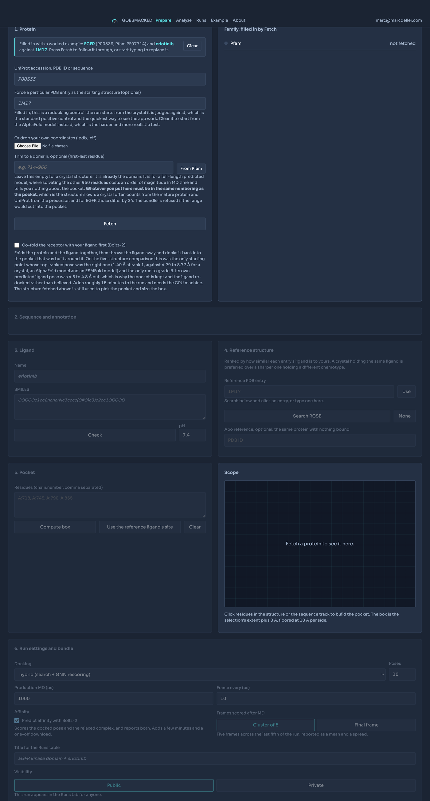

# 🔬 GOBSMACKED

> **Fold, dock, relax and annotate a protein-ligand complex, then check it against the experimental structure.**

[](https://gobsmacked.mdeller.com)                     

<table>
<tr>
<td>🌐 <b>App</b></td><td><a href="https://gobsmacked.mdeller.com" target="_blank" rel="noopener noreferrer">gobsmacked.mdeller.com</a></td>
<td>✉️ <b>Contact</b></td><td><a href="mailto:marc@marcdeller.com">marc@marcdeller.com</a></td>
<td>🐙 <b>GitHub</b></td><td><a href="https://github.com/bellcheddar/GOBSMACKED" target="_blank" rel="noopener noreferrer">bellcheddar/GOBSMACKED</a></td>
</tr>
</table>

---


**GOBSMACKED** (Ground-truth Overlay for Binding Sites, Modes And Complex Kinetics/Dynamics) takes a protein and a ligand, folds and docks and relaxes them, and then does the thing most docking pipelines skip: it goes and finds the crystal structure, superposes on the binding pocket, and tells you how close you got and why.

**Why it matters:** a docking score is a ranking, not a measurement, and a pretty predicted complex looks exactly the same whether it is right or wrong. GOBSMACKED answers three separate questions about one prediction: how close the pose lands to the crystal (PIER REVIEW), whether molecular dynamics recovers the induced fit that an apo-like predicted pocket is missing (HOLOGRAM), and whether the binding mode the prediction implies is the binding mode the crystal shows (GATEKEEPER). It is useful for: anyone validating a docking protocol before trusting it on a target with no structure, anyone asking whether ESMFold plus docking is good enough for a particular pocket, and anyone who wants the answer as a graded scorecard rather than as a folder of PDB files.

---

## 🧭 How it works

The heavy compute does not run on the server. ESMFold, the PandaDock GNN and OpenMM need a GPU and several gigabytes; the host is a shared CPU droplet with 3.8 GB. So the work is split in two, with an archive passing between them.


| Stage | Where | What happens |
|---|---|---|
| **Prepare** | droplet, CPU | Resolve the input, fetch the best available structure, annotate the family, pick the pocket, choose a reference crystal, emit `run_bundle.tar.gz` |
| **Run** | your machine, GPU | `pixi run gobsmacked`: fold (if needed), prep, dock, minimise and run MD, summarise, emit `results.tar.gz` |
| **Analyze** | droplet, CPU | Validate the archive, superpose on the pocket, run PLIP and PandaMap, grade, classify the binding mode, draw the trajectory |

Nothing in the bundle contacts the server. The campaign file goes in, the results archive comes back, and both are validated against a schema so a failed stage never turns into a puzzling analysis.

## 🚀 Quick start

Open [gobsmacked.mdeller.com](https://gobsmacked.mdeller.com), paste a UniProt accession and a SMILES, pick a pocket, and download the bundle. Then, on a machine with a GPU:

```bash
tar xzf run_bundle_gs_20260905_xxxxxxxxxxxx.tar.gz
cd run_bundle_gs_20260905_xxxxxxxxxxxx
pixi install
pixi run gobsmacked          # writes results/results.tar.gz
```

Upload `results/results.tar.gz` on the Analyze tab. The whole analysis takes seconds and lands on one page.

To run the web application locally:

```bash
git clone https://github.com/bellcheddar/GOBSMACKED.git
cd GOBSMACKED
uv venv --python 3.11 .venv
uv pip install --python .venv/bin/python -r requirements.txt
make serve                   # http://127.0.0.1:8009
```

## 🔧 Prepare

Four panels, each unlocking the next.

| Panel | Accepts | What it does |
|---|---|---|
| **1. Protein** | UniProt accession, PDB ID, raw sequence, or a dropped `.pdb` / `.cif` | Resolves the canonical sequence and picks a starting structure by a fixed, reported priority: your upload > a named PDB entry > AlphaFold DB > ESM Atlas > fold it in the bundle |
| **2. Annotation** | (automatic) | InterPro supplies Pfam domains, which route the target: `PF00069`/`PF07714` to KLIFS, `PF00001`/`PF00002`/`PF00003`/`PF10324` to GPCRdb, anything else to UniProt features alone |
| **3. Ligand and pocket** | SMILES, plus residues clicked in Mol* or on the sequence track | RDKit validates and draws the ligand; the docking box is the selection's extent plus 8 Å, floored at 18 Å per side |
| **4. Reference** | (automatic, or a typed PDB ID) | RCSB entries mapped to the accession, ranked by Morgan Tanimoto against your ligand, with resolution and a 2D depiction |



**Reference selection prefers the same ligand over a sharper crystal.** EGFR and erlotinib make the case: 1M17 holds erlotinib itself at 2.6 Å, while the best sub-2.5 Å entry holds gefitinib at Tanimoto 0.41. Judging an erlotinib pose against a gefitinib crystal because the crystal is 0.9 Å sharper would measure the wrong thing.

**Visibility** is chosen here and defaults to public. A private run is issued a 32-character owner key, shown once, stored only as its sha256, and carried inside the bundle so uploading results needs no typing. Private runs are **absent** from the Runs table without the key rather than greyed out: a greyed row would leak that the run exists, and how many there are.

## ⚗️ Run

Five stages, each idempotent and resumable from a `.done` marker.

| Stage | Tool | Notes |
|---|---|---|
| `fold` | ESMFold | Skipped when the bundle carries a model, which is the usual case. Chunk size scales with sequence length; pocket residues below pLDDT 70 raise a warning that reaches the scorecard |
| `prep` | PDBFixer, RDKit | Missing atoms, hydrogens at the campaign pH, waters and heteroatoms removed. Terminal missing residues are deliberately not built: they are absent from the construct, not from the model |
| `dock` | PandaDock | `hybrid` (search plus SE(3) GNN rescoring), `flex` (induced fit) or `dock` (empirical only). Falls back from `hybrid` to `dock` when the GNN checkpoint cannot be fetched, and says so |
| `md` | OpenMM, OpenFF | Amber14 plus OpenFF Sage, TIP3P with 0.15 M NaCl and 10 Å padding, restraints released over the equilibration, 2 fs with hydrogen mass repartitioning. The DCD holds the solute only |
| `summarise` | MDTraj | Per-frame ligand and backbone RMSD, per-residue RMSF, pocket volume by voxel counting, a residue-by-frame contact matrix, then packs the archive |

```bash
pixi run gobsmacked --list          # what would run, and what is already done
pixi run gobsmacked --stage dock    # rerun from dock onward
```

Target on one consumer GPU: under 30 minutes for a 300-residue domain with the default 1 ns production. The runner prints a wall-clock estimate before it starts.

## 📊 Analyze

Upload the archive and the whole pipeline runs inside the request: ingest, superpose, interactions, modes, dynamics, scorecard. Seconds, not minutes.

**Superposition is on pocket Cα atoms, never on the whole chain.** A model can be excellent at the binding site and 6 Å out at a disordered terminus; superposing whole chains spreads that error into the pocket and inflates the ligand RMSD, which is the one number this app exists to report honestly. The whole-chain TM-score is reported alongside, as context.

**Residue numbering is never assumed to match.** The reference chain and the model are aligned by sequence first and every measurement walks that mapping. 1M17 numbers EGFR from the mature protein, 24 lower than UniProt: comparing raw numbers would make every contact look lost and the interaction overlap read as zero.

### 🎯 The scorecard

| Metric | A | B | C | D | F | Weight |
|---|---|---|---|---|---|---|
| Ligand RMSD, best of pose 1 and MD-final | ≤ 1.0 Å | ≤ 2.0 | ≤ 3.0 | ≤ 4.0 | > 4.0 | 30 |
| PLIP interaction Jaccard, best of pose 1 and MD-final | ≥ 0.75 | ≥ 0.55 | ≥ 0.40 | ≥ 0.25 | < 0.25 | 20 |
| Pocket Cα RMSD, MD-final | ≤ 0.8 | ≤ 1.2 | ≤ 1.8 | ≤ 2.5 | > 2.5 | 15 |
| χ1 agreement, MD-final (within 40°) | ≥ 0.85 | ≥ 0.70 | ≥ 0.55 | ≥ 0.40 | < 0.40 | 10 |
| MD stability: ligand drift, last window minus first | ≤ 0.5 Å | ≤ 1.0 | ≤ 1.5 | ≤ 2.5 | > 2.5 | 10 |
| Rescue: pocket Cα RMSD before MD minus after | ≥ +0.5 Å | ≥ +0.2 | ≥ 0 | ≥ −0.3 | < −0.3 | 10 |
| Pose validity: clashes, bond lengths, chirality, inside the box | pass | | | | fail | 5 |

The composite **GOBSMACK score** is the weighted mean of those grades. Three rules keep it honest:

- **A metric that could not be measured drops out** and the remaining weights are renormalised, which the card states rather than hiding in the arithmetic.
- **A validity failure caps the composite at 40.** A pose with a 1.8 Å clash is not a B whatever else it scored.
- **A run with no reference gets no composite at all.** There is nothing to verify it against, and scoring it on the two metrics that survive would be a grade for something nobody checked.

Every gauge carries one plain sentence saying what the number means and what to do about it, because "χ1 agreement 0.42" is not actionable and "most pocket side chains are in the wrong rotamer, which is what an apo-like predicted pocket looks like: try flex docking plus a longer equilibration" is.

### 🧬 The overlay

Model in grey, MD-final in phosphor, the crystal in amber, all superposed on the pocket, with the ten most displaced side chains and their χ1 angles listed underneath.


### 🔑 The binding mode

Two families get a real answer and everything else gets an honest one.

**Kinases** are labelled from the KLIFS 85-residue pocket, mapped onto the target sequence region by region. DFG-in / out / inter follows the Modi and Dunbrack distance criteria; αC-in / out follows the β3-Lys to αC-Glu salt bridge; the Type I / I½ / II / allosteric label follows which subpockets the ligand occupies.

**GPCRs** are labelled from GPCRdb generic numbering: orthosteric, vestibule, intracellular or lipid-facing from the contacts, and active-like or inactive-like from the TM3-TM6 distance, with the NPxxY RMSD, the toggle switch χ1, the PIF motif and the sodium site reported alongside.

Both classifiers run on the prediction and on the crystal with the same code, so a difference in the label is a difference in the structure and not a difference in method.

### 🧪 Thresholds that were measured, not quoted

Two numbers in this repository were placed by measuring structures with this code rather than by taking a value from a paper that used a different atom pair:

- **The TM3-TM6 activation cut is 13 Å**, from six structures: inactive rhodopsin 1GZM 8.7, A2A 3EML 9.7, β2AR 2RH1 11.2; active metarhodopsin 3PQR 14.7, A2A 5G53 18.5, β2AR 3SN6 19.0. (Quoted "ionic lock" distances of 3 to 4 Å are guanidinium-to-carboxylate, not Cα-to-Cα, and are not comparable.)
- **A subpocket counts as occupied at two contacts, not one.** Erlotinib in 1M17 grazes exactly one αC residue at 4 Å, and a one-contact rule labels a textbook Type I inhibitor as Type I½.

## 🧱 Stack

| Component | Role | Licence | Where it runs |
|---|---|---|---|
| Flask, gunicorn, nginx, SQLite | Web application and store | BSD / MIT / public domain | droplet |
| biotite, tmtools, gemmi, NumPy, SciPy | Alignment, superposition, TM-score | BSD / MIT / MPL | droplet |
| RDKit | SMILES, depiction, fingerprints, symmetry-aware RMSD | BSD-3 | droplet and bundle |
| PLIP | Interaction fingerprints | GPL-2.0 | droplet only, as a subprocess |
| PandaMap | 2D interaction maps, empirical ΔG | MIT | droplet |
| PandaDock | Docking (hybrid search plus SE(3) GNN rescoring) | MIT | bundle |
| ESMFold, OpenFold | Folding when no model exists | MIT / Apache-2.0 | bundle |
| OpenMM, PDBFixer, openmmforcefields | Preparation, minimisation, MD | MIT / LGPL | bundle |
| MDTraj | Trajectory analysis | LGPL-2.1 | bundle and droplet |
| Mol*, Plotly.js | 3D views and traces | MIT | browser |

**PLIP is GPL-2.0 and is run as a subprocess, never imported.** What crosses the boundary is an XML file, so no GPL code is linked into this MIT-licensed application, and PLIP is deliberately absent from the run bundle. Full attribution, with every DOI checked against Crossref, is in [THIRD_PARTY.md](THIRD_PARTY.md) and on the app's About page: both are generated from `software.yaml`, so they cannot drift.

## 📁 Repository layout

```
app/                     the Flask application (droplet only, no torch)
  routes/                prepare, analyze, runs, about
  services/              fetch, annotate, references, bundle, ingest,
                         superpose, interactions, scorecard, modes, dynamics
  templates/  static/    Jinja2, the instrument-panel CSS, Mol* and Plotly
bundle_template/         copied verbatim into every run bundle
  run.py                 the five-stage runner with resume markers
  gobsmacked_run/        fold, prep, dock, md, summarise, schema
design/                  the visual contract this app is built from
deploy/                  systemd units, nginx site, provision and deploy scripts
scripts/                 prune, DOI checker, THIRD_PARTY generator
tests/                   65 tests, plus two fixture archives built from crystals
software.yaml            the single source of truth for attribution
```

## 🧫 Testing

```bash
make test                # 65 tests, about 40 seconds
make check-refs          # every DOI in software.yaml, checked against Crossref
make third-party         # regenerate THIRD_PARTY.md from software.yaml
python tests/fixtures/build_fixtures.py    # rebuild the two fixture archives
```

The fixtures are built from real crystals rather than from noise: 4HJO judged against 1M17, and 5D5A against 2RH1, with the ligand displaced to make a plausible docked pose and the bundle's own `summarise` stage computing the trajectory summary. So they exercise the last stage of the bundle as well as the first stage of the server.

End to end, EGFR plus erlotinib scores 83.5 (B) against 1M17 and labels Type I, DFG-in on both sides; β2AR plus carazolol scores 94.0 (A) against 2RH1 and labels orthosteric, inactive-like on both.

## 🌐 Deployment

```bash
cp .env.example .env         # DROPLET_SSH, SERVER_NAME, BIND_ADDR
bash deploy/deploy.sh        # rsync, reinstall dependencies, restart, verify the live page
```

First time only, on the droplet as root:

```bash
sudo SERVER_NAME=gobsmacked.mdeller.com bash /opt/gobsmacked/deploy/provision.sh
```

That installs the service user, the virtual environment, the systemd unit, the nightly prune timer, the nginx site and a Let's Encrypt certificate. The prune drops the results archive of public runs older than 90 days while keeping the scorecard, the report and the final structures, so the Runs row stays useful. Private runs are never pruned.

## ✅ To Do

Roadmap for GOBSMACKED, in dependency order. Suggestions welcome.

- [x] **Prepare, without references.** Input resolution across UniProt, RCSB, AlphaFold DB, ESM Atlas and uploads, with the priority reported rather than silently applied. Pfam routing, KLIFS and GPCRdb clients behind a 30-day cache, the Mol* pocket picker and the SVG sequence track
- [x] **Map the KLIFS pocket onto an arbitrary sequence.** The 85-character pocket string carries no residue numbers and only its regions are contiguous, so it is placed region by region, longest run first, with a bounded difflib pass for regions the alignment shifted. 83 of 85 positions map for EGFR, putting the gatekeeper on Thr790, the hinge on Met793 and DFG on Asp855
- [x] **The run bundle.** Five resumable stages in a self-contained pixi environment, with the GNN fallback, the platform choice and the solute-only trajectory
- [x] **Analyze, with verification.** Pocket-Cα superposition, symmetry-corrected ligand RMSD, χ1 agreement, PLIP fingerprints compared in reference numbering, PandaMap, the scorecard and the dynamics panels
- [x] **Both binding-mode classifiers, on day one.** Kinase and GPCR, each validated against structures whose labels are known: 1M17 Type I DFG-in, 1IEP Type II DFG-out, 2RH1 orthosteric inactive-like, 3SN6 active-like
- [x] **Runs and ownership.** Public and private runs, an owner key stored only as a hash, unguessable job IDs, and private runs absent from listings rather than redacted in them
- [x] **The About page.** A hand-drawn pipeline schematic, the grade thresholds, and a software table generated from the same file as THIRD_PARTY.md with every DOI checked against Crossref
- [x] **Deploy to gobsmacked.mdeller.com.** Provisioned, certificated and serving over HTTP/2, with the nightly prune timer armed. The static location deliberately sets no `access_log`: nginx.conf gives the droplet the `vhost` format that appends the requested host, and naming `combined` in the location would silently zero this app's visit count on the mdeller.com launcher
- [ ] **Run the real loop once, end to end.** The fixtures are built from crystals, which tests every code path but not PandaDock or OpenMM themselves, and the live server has now analysed one of them in 15 seconds. One genuine EGFR run on a GPU box, uploaded and scored, is the acceptance test that remains
- [x] **PLIP interactions drawn in Mol\*, and the pocket as sticks.** Mol*'s viewer build exports no shape builder, so each interaction is loaded as a tiny structure of two-atom fragments joined by CONECT records: a run of them along PLIP's own endpoints reads as a dashed line, one file and one colour per interaction type. The lines are therefore the interactions the table lists rather than a second opinion computed by the viewer, which would quietly disagree with it
- [x] **An apo reference in the overlay.** Optional on Panel 4, fetched and stripped of its ligands at analysis time, and drawn in purple as a fourth toggle: the shape the pocket has with nothing bound, which is the shape a predicted model tends to resemble
- [ ] **STEVEDORE: multi-ligand SAR series.** Score a congeneric series against one reference and correlate with ChEMBL affinity, which turns a single verification into a protocol assessment
- [ ] **DOCKYARD: ingest poses from other engines.** Boltz-2, Vina and DiffDock all produce poses this scorecard could grade, and the comparison is more interesting than any single engine's self-report
- [ ] **Cryptic pocket detection.** The pocket volume trace already shows a pocket opening and closing during MD; naming that as a finding rather than a plot is the next step

---

## 👤 Author

**Marc C. Deller, D.Phil.**  
Structural biologist & drug discovery scientist  

<table>
<tr>
<td>🌐</td><td><a href="https://marcdeller.com" target="_blank" rel="noopener noreferrer">marcdeller.com</a></td>
<td>✉️</td><td><a href="mailto:marc@marcdeller.com">marc@marcdeller.com</a></td>
<td>🐙</td><td><a href="https://github.com/bellcheddar/GOBSMACKED" target="_blank" rel="noopener noreferrer">github.com/bellcheddar/GOBSMACKED</a></td>
</tr>
</table>

Released under the MIT licence. The app name is a joke; the numbers are not.
