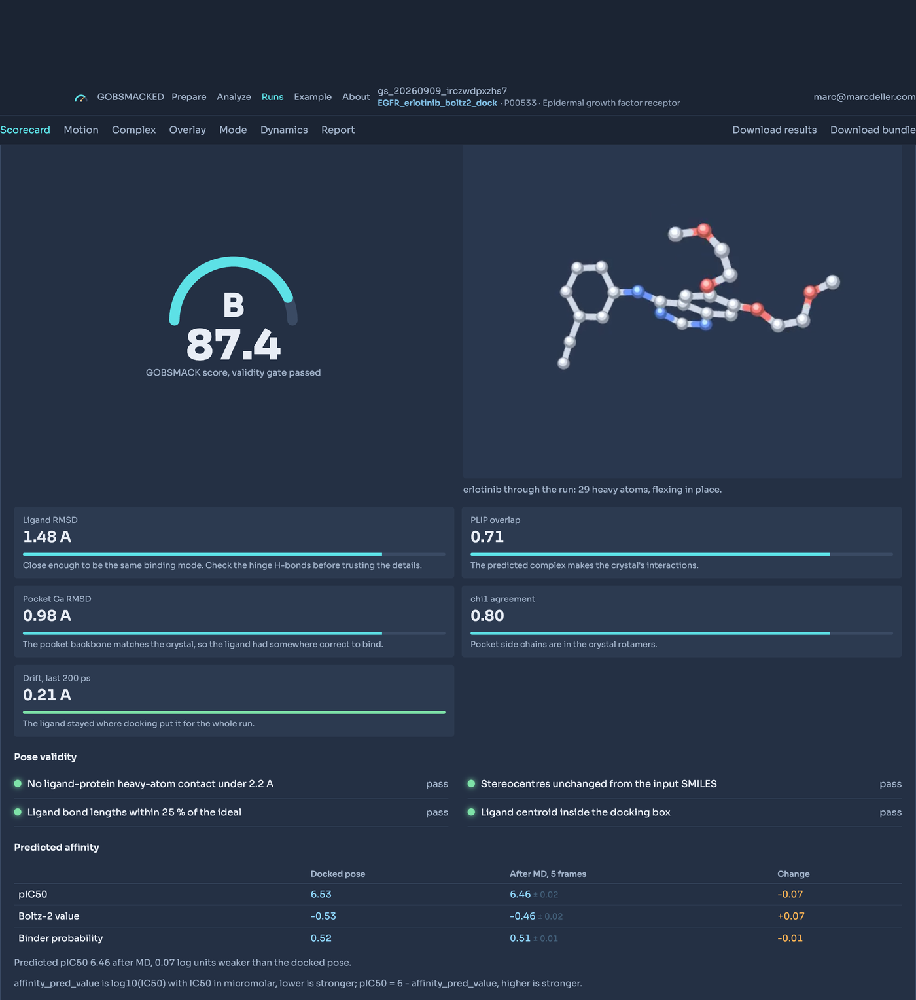
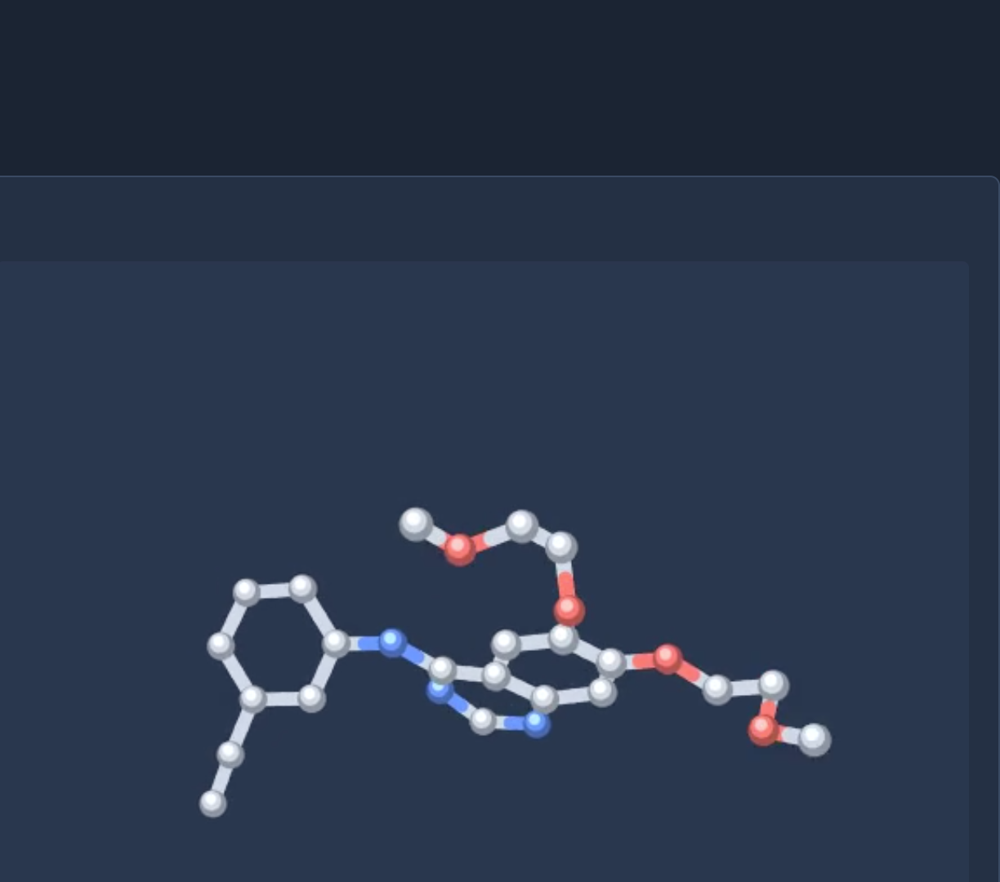

# 🔬 GOBSMACKED

> **Fold, dock, relax and annotate a protein-ligand complex, then check it against the experimental structure.**

[](https://gobsmacked.mdeller.com)                      

<table>
<tr>
<td>🌐 <b>App</b></td><td><a href="https://gobsmacked.mdeller.com" target="_blank" rel="noopener noreferrer">gobsmacked.mdeller.com</a></td>
<td>✉️ <b>Contact</b></td><td><a href="mailto:marc@marcdeller.com">marc@marcdeller.com</a></td>
<td>🐙 <b>GitHub</b></td><td><a href="https://github.com/bellcheddar/GOBSMACKED" target="_blank" rel="noopener noreferrer">bellcheddar/GOBSMACKED</a></td>
</tr>
</table>

---



## What this is asking

**Can a predicted protein structure be docked well enough to reproduce an experimental
one?** Given a sequence and a SMILES and no crystal, is the complex you get back close to
the complex crystallography would have given you, and can you tell without looking?

The answer this pipeline has arrived at, after two full campaigns on two protein families:
**what limits the result is target-specific, and you cannot tell which limit you are up
against by looking at the model.**

On **EGFR**, docking into an AlphaFold model did not reproduce the crystal, and the reason
was not the model: nothing in any of those pose sets came within 6.5 A, so the search was
the limit. **Co-folding the receptor with the ligand first** (Boltz-2, then discard its
ligand and re-dock) built a pocket in which the search reliably found a near-native pose,
and **re-ranking those poses with Vinardo** picked it where the docking engine's own scoring
function did not. The two together moved the same receptor and the same search from **D 56.2
to B 84.8**, with a ligand 1.6 A from the crystal instead of 8.7 A.

On **β2AR** none of that applied. AlphaFold's pocket was already 0.32 A from the crystal,
co-folding had nothing to add, and all three AlphaFold runs graded B or better, including
the best result of either campaign. There the search was never the limit and the docking mode
decided the outcome instead: flexible-receptor docking, the *worst* option on EGFR, gave the
only A grade.

**Re-ranking with Vinardo helped on both.** So did refusing to score a pose on its predicted
affinity, and refusing to read pocket accuracy as pose accuracy: four β2AR receptors within
0.016 A of each other produced answers spanning 1.13 to 5.69 A. When the search never
produces a near-native pose, nothing downstream rescues it, and the scorecard says so rather
than reporting a confident wrong answer.

Both campaigns are written up below, separately and in full, because the disagreement between
them is more informative than either on its own.

```
  PREPARE  (server, CPU)                    the campaign
  ─────────────────────────────────────────────────────────────────
   sequence ──► fetch structure ──► annotate family ──► pick pocket
   + SMILES     PDB / AFDB / ESM    InterPro, KLIFS       Mol*
                                                            │
                                    choose reference ◄──────┘
                                    RCSB + Tanimoto
                                            │
                                    campaign.yaml ──► run_bundle.tar.gz
  ─────────────────────────────────────────────────────────────────
                                            ▼
  RUN  (your machine, GPU)                  the prediction
  ─────────────────────────────────────────────────────────────────
   1  FOLD       ESMFold          ──or──  Boltz-2 CO-FOLD
                 sequence only            protein + ligand together,
                                          keep the protein, discard
                                          the pose, move the box
   2  PREP       PDBFixer, RDKit
   3  DOCK       PandaDock          10 poses, ranked by the engine
   4  RANK       Vinardo            re-ranks them; its choice goes on
   5  MD         OpenMM, OpenFF     relax pose 1, 500 ps
   6  AFFINITY   Boltz-2 head       reported, never scored  (optional)
   7  SUMMARISE  MDTraj             ──► results.tar.gz
  ─────────────────────────────────────────────────────────────────
                                            ▼
  ANALYZE  (server, CPU)                    the verdict
  ─────────────────────────────────────────────────────────────────
   superpose on the pocket ──► PLIP + PandaMap ──► binding mode
   vs the crystal               contacts             KLIFS / GPCRdb
                                    │
                                    ▼
                          GOBSMACK score, A to F
```

**GOBSMACKED** (Ground-truth Overlay for Binding Sites, Modes And Complex Kinetics/Dynamics) takes a protein and a ligand, folds and docks and relaxes them, and then does the thing most docking pipelines skip: it goes and finds the crystal structure, superposes on the binding pocket, and tells you how close you got and why.

**Why it matters:** a docking score is a ranking, not a measurement, and a pretty predicted complex looks exactly the same whether it is right or wrong. GOBSMACKED answers three separate questions about one prediction: how close the pose lands to the crystal, whether the contacts it makes are the contacts the crystal shows, and whether the binding mode it implies is the binding mode the crystal has. It is useful for: anyone validating a docking protocol before trusting it on a target with no structure, anyone asking whether ESMFold plus docking is good enough for a particular pocket, and anyone who wants the answer as a graded scorecard rather than as a folder of PDB files.

---

## 🧭 How it works

The heavy compute does not run on the server. ESMFold, the PandaDock GNN and OpenMM need a GPU and several gigabytes; the host is a shared CPU droplet with 3.8 GB. So the work is split in two, with an archive passing between them.


| Stage | Where | What happens |
|---|---|---|
| **Prepare** | droplet, CPU | Resolve the input, fetch the best available structure, annotate the family, pick the pocket, choose a reference crystal, emit `run_bundle.tar.gz` |
| **Run** | your machine, GPU | `pixi run gobsmacked`: fold or co-fold, prep, dock, re-rank the poses, minimise and run MD, score the affinity before and after, summarise, emit `results.tar.gz` |
| **Analyze** | droplet, CPU | Validate the archive, superpose on the pocket, run PLIP and PandaMap, grade, classify the binding mode, draw the trajectory |

Nothing in the bundle contacts the server. The campaign file goes in, the results archive comes back, and both are validated against a schema so a failed stage never turns into a puzzling analysis.

## 🚀 Quick start

Open [gobsmacked.mdeller.com](https://gobsmacked.mdeller.com), paste a UniProt accession and a SMILES, pick a pocket, and download the bundle. Then, on a machine with a GPU:

```bash
curl -fL "https://gobsmacked.mdeller.com/runs/<job-id>/bundle" | tar xz \
  && cd run_bundle_<job-id> && ./run.sh
```

Prepare prints that line with the job filled in and a copy button. One step, and the only
prerequisites are `curl` and `bash`: the bundle carries its own `pixi.lock`, and `run.sh`
installs pixi if the machine has not got it, builds the environment from the lock (no solve, so
the versions are the ones the bundle was tested with) and runs all six stages. The environment
lives in `.pixi/` inside the bundle directory, so nothing is installed system-wide.

Upload `results.tar.gz` on the Analyze tab when it finishes. It is written at the top level of the
bundle directory, next to `run.sh`, rather than inside `results/`: the archive is the one file the
run exists to produce and nobody should have to go looking for it.

To run the web application locally:

```bash
git clone https://github.com/bellcheddar/GOBSMACKED.git
cd GOBSMACKED
uv venv --python 3.11 .venv
uv pip install --python .venv/bin/python -r requirements.txt
make serve                   # http://127.0.0.1:8009
```

## 🔧 Prepare

Four panels, each unlocking the next.

| Panel | Accepts | What it does |
|---|---|---|
| **1. Protein** | UniProt accession, PDB ID, raw sequence, or a dropped `.pdb` / `.cif`, plus an optional domain range | Resolves the canonical sequence and picks a starting structure by a fixed, reported priority: your upload > a named PDB entry > AlphaFold DB > ESM Atlas > fold it in the bundle. **From Pfam** fills the range from the domain the pocket sits in |
| **2. Annotation** | (automatic) | InterPro supplies Pfam domains, which route the target: `PF00069`/`PF07714` to KLIFS, `PF00001`/`PF00002`/`PF00003`/`PF10324` to GPCRdb, anything else to UniProt features alone |
| **3. Ligand and pocket** | SMILES, plus residues clicked in Mol* or on the sequence track | RDKit validates and draws the ligand; the docking box is the selection's extent plus 8 Å, floored at 18 Å per side |
| **4. Reference** | (automatic, or a typed PDB ID) | RCSB entries mapped to the accession, ranked by Morgan Tanimoto against your ligand, with resolution and a 2D depiction |


**Trim to the domain.** An AlphaFold model is of the whole precursor. EGFR's is 1,210 residues, of which the kinase domain is 253: solvating the other 957 costs an order of magnitude in MD time, adds two disordered tails that wander through the box, and tells you nothing about the pocket.

**The reference's site is renumbered onto your model.** 1M17 numbers EGFR from the mature protein and UniProt from the precursor, 24 apart. Pasting the crystal's residue list straight into the pocket picker would select real residues that are the wrong ones, which is worse than an error, so both structures are aligned by sequence first.

**The docking box is sized from the ligand, not from the residues around it.** Erlotinib's own extent plus padding is 32 x 21 x 23 A; the shell of its 51 contacting residues gives 48 x 42 x 42, a search volume five times larger that samples the true site less densely for no benefit. The centre still comes from the model, because the crystal is in its own coordinate frame and only the extent transfers.

**Reference selection prefers the same ligand over a sharper crystal.** EGFR and erlotinib make the case: 1M17 holds erlotinib itself at 2.6 Å, while the best sub-2.5 Å entry holds gefitinib at Tanimoto 0.41. Judging an erlotinib pose against a gefitinib crystal because the crystal is 0.9 Å sharper would measure the wrong thing.

**Visibility** is chosen here and defaults to public. A private run is issued a 32-character owner key, shown once, stored only as its sha256, and carried inside the bundle so uploading results needs no typing. Private runs are **absent** from the Runs table without the key rather than greyed out: a greyed row would leak that the run exists, and how many there are.

## ⚗️ Run

Seven steps, each idempotent and resumable from a `.done` marker. Re-ranking runs inside
the dock stage rather than as a stage of its own, because it re-orders that stage's output
and has nothing of its own to resume.

| Stage | Tool | Notes |
|---|---|---|
| `fold` | ESMFold, or Boltz-2 | Skipped when the bundle carries a model, which is the usual case. Chunk size scales with sequence length; pocket residues below pLDDT 70 raise a warning that reaches the scorecard. With **co-folding** selected on Prepare, the protein is folded *with* the ligand by Boltz-2, the predicted ligand pose is discarded and the ligand is docked again into the pocket built around it |
| `prep` | PDBFixer, RDKit | Missing atoms, hydrogens at the campaign pH, waters and heteroatoms removed. Terminal missing residues are deliberately not built: they are absent from the construct, not from the model |
| `dock` | PandaDock, smina | `hybrid` (search plus SE(3) GNN rescoring), `flex` (induced fit) or `dock` (empirical only). Falls back from `hybrid` to `dock` when the GNN checkpoint cannot be fetched, and says so |
| `rank` | smina, Vinardo | The ten poses are re-scored and **re-ordered**; Vinardo's choice is the pose carried forward, and the engine's own rank stays as a column in `scores.csv`. `docking.rank_by: engine` turns it off |
| `md` | OpenMM, OpenFF | Amber14 plus OpenFF Sage, TIP3P with 0.15 M NaCl and 10 Å padding, restraints released over the equilibration, 2 fs with hydrogen mass repartitioning. The DCD holds the solute only |
| `affinity` | Boltz-2 | Optional, on by default. The docked pose and frames sampled from the last fifth of the trajectory, each scored by Boltz-2's affinity head with the structure module bypassed. The MSA is computed once per target and cached, so only the first pose queries the server |
| `summarise` | MDTraj | Per-frame ligand and backbone RMSD, per-residue RMSF, pocket volume by voxel counting, a residue-by-frame contact matrix, then packs the archive |

```bash
./run.sh --list          # what would run, and what is already done
./run.sh --stage dock    # rerun from dock onward
```

Target on one consumer GPU: under 30 minutes for a 300-residue domain with the default 1 ns
production, and roughly an hour with the affinity stage on, which is the slowest of the six once
the MD is short. The runner prints a per-stage plan with wall-clock estimates and a finishing time
before it starts, then a progress bar and a running ETA for each stage as it goes.

**Warnings are triaged rather than dumped.** Every third-party warning the run emits was read
once, and each is either fixed at the source, suppressed by an exact-match filter with the reason
recorded next to it, or left visible because it is telling you something. What reaches the terminal
is what a reader should act on.

## 📊 Analyze

Upload the archive and the whole pipeline runs inside the request: ingest, superpose, interactions, modes, dynamics, scorecard. Seconds, not minutes.

**Superposition is on pocket Cα atoms, never on the whole chain.** A model can be excellent at the binding site and 6 Å out at a disordered terminus; superposing whole chains spreads that error into the pocket and inflates the ligand RMSD, which is the one number this app exists to report honestly. The whole-chain TM-score is reported alongside, as context.

**Residue numbering is never assumed to match.** The reference chain and the model are aligned by sequence first and every measurement walks that mapping. 1M17 numbers EGFR from the mature protein, 24 lower than UniProt: comparing raw numbers would make every contact look lost and the interaction overlap read as zero.

### 🎯 The scorecard

| Metric | A | B | C | D | F | Weight |
|---|---|---|---|---|---|---|
| Ligand RMSD, best of pose 1 and MD-final | ≤ 1.0 Å | ≤ 2.0 | ≤ 3.0 | ≤ 4.0 | > 4.0 | 34 |
| PLIP interaction Jaccard, best of pose 1 and MD-final | ≥ 0.75 | ≥ 0.55 | ≥ 0.40 | ≥ 0.25 | < 0.25 | 22 |
| Pocket Cα RMSD, MD-final | ≤ 0.8 | ≤ 1.2 | ≤ 1.8 | ≤ 2.5 | > 2.5 | 17 |
| χ1 agreement, MD-final (within 40°) | ≥ 0.85 | ≥ 0.70 | ≥ 0.55 | ≥ 0.40 | < 0.40 | 11 |
| MD stability: ligand drift, last window minus first | ≤ 0.5 Å | ≤ 1.0 | ≤ 1.5 | ≤ 2.5 | > 2.5 | 11 |
| Pose validity: clashes, bond lengths, chirality, inside the box | pass | | | | fail | 5 |

How far MD moved the pocket is reported beneath the score and not graded: across every run
measured it has moved the pocket *away* from the crystal, so the number says what happened
rather than how well it went.

The composite **GOBSMACK score** is the weighted mean of those grades. Three rules keep it honest:

- **A metric that could not be measured drops out** and the remaining weights are renormalised, which the card states rather than hiding in the arithmetic.
- **A validity failure caps the composite at 40.** A pose with a 1.8 Å clash is not a B whatever else it scored.
- **A run with no reference gets no composite at all.** There is nothing to verify it against, and scoring it on the two metrics that survive would be a grade for something nobody checked.

Every gauge carries one plain sentence saying what the number means and what to do about it, because "χ1 agreement 0.42" is not actionable and "most pocket side chains are in the wrong rotamer, which is what an apo-like predicted pocket looks like: try flex docking plus a longer equilibration" is.

### 🧬 The overlay

Model in grey, MD-final in phosphor, the crystal in amber, all superposed on the pocket, with the ten most displaced side chains and their χ1 angles listed underneath.



### 🧲 Affinity, before and after MD

Boltz-2's affinity head scores the docked pose and the relaxed complex, so the panel answers a
question the rest of the scorecard cannot: did relaxing the pose change what the model thinks of
it. Each is reported as pIC50, the raw `affinity_pred_value` (log10 of IC50 in micromolar, lower
is stronger) and the binder probability, with the change between them. The post-MD figure is a
mean over several frames from the last fifth of the trajectory, with its standard deviation, so a
prediction that swings by a log unit across the sampled window says so rather than presenting one
frame as the answer.

**It sits beside the grade, not inside it.** Every graded metric has a crystal to be right or
wrong about and a predicted affinity has none. It is also measurably not a pose-quality signal:
see the findings section below.

**A missing affinity is a missing panel, not a failed run.** The stage declines rather than
raising: no ligand it can parameterise, no MSA, the affinity head writing nothing for a pose. The
reason is carried into the archive and shown on the card, and the other five stages are untouched.

### 🎲 Every pose, not just the top one

The scorecard grades one pose. The overlay panel draws all ten and tabulates, per pose, both
scoring functions, the in-place RMSD to the top pose, the centroid separation, a best-fit shape
RMSD, and the closest heavy-atom approach to the receptor — so a run that found the right answer
and ranked it fourth is visible rather than hidden.

The distinction between the two RMSDs is the useful part. In-place RMSD asks how far this pose
sits from that one; best-fit shape RMSD asks whether it is the same conformer put somewhere else.
A pair that is 6 Å apart in place and 0.4 Å after superposition is one pose docked into two sites,
which is a search problem. A pair that is 6 Å apart both ways is two genuinely different bound
conformations, which is not.

### 🔑 The binding mode

Two families get a real answer and everything else gets an honest one.

**Kinases** are labelled from the KLIFS 85-residue pocket, mapped onto the target sequence region by region. DFG-in / out / inter follows the Modi and Dunbrack distance criteria; αC-in / out follows the β3-Lys to αC-Glu salt bridge; the Type I / I½ / II / allosteric label follows which subpockets the ligand occupies.

**GPCRs** are labelled from GPCRdb generic numbering: orthosteric, vestibule, intracellular or lipid-facing from the contacts, and active-like or inactive-like from the TM3-TM6 distance, with the NPxxY RMSD, the toggle switch χ1, the PIF motif and the sodium site reported alongside.

Both classifiers run on the prediction and on the crystal with the same code, so a difference in the label is a difference in the structure and not a difference in method.

### 🧪 Thresholds that were measured, not quoted

Two numbers in this repository were placed by measuring structures with this code rather than by taking a value from a paper that used a different atom pair:

- **The TM3-TM6 activation cut is 13 Å**, from six structures: inactive rhodopsin 1GZM 8.7, A2A 3EML 9.7, β2AR 2RH1 11.2; active metarhodopsin 3PQR 14.7, A2A 5G53 18.5, β2AR 3SN6 19.0. (Quoted "ionic lock" distances of 3 to 4 Å are guanidinium-to-carboxylate, not Cα-to-Cα, and are not comparable.)
- **A subpocket counts as occupied at two contacts, not one.** Erlotinib in 1M17 grazes exactly one αC residue at 4 Å, and a one-contact rule labels a textbook Type I inhibitor as Type I½.

## 🧱 Stack

| Component | Role | Licence | Where it runs |
|---|---|---|---|
| Flask, gunicorn, nginx, SQLite | Web application and store | BSD / MIT / public domain | droplet |
| biotite, tmtools, gemmi, NumPy, SciPy | Alignment, superposition, TM-score | BSD / MIT / MPL | droplet |
| RDKit | SMILES, depiction, fingerprints, symmetry-aware RMSD | BSD-3 | droplet and bundle |
| PLIP | Interaction fingerprints | GPL-2.0 | droplet only, as a subprocess |
| PandaMap | 2D interaction maps, empirical ΔG | MIT | droplet |
| PandaDock | Docking (hybrid search plus SE(3) GNN rescoring) | MIT | bundle |
| Boltz-2 | Affinity head, on the docked pose and on MD frames | MIT | bundle |
| ESMFold, OpenFold | Folding when no model exists | MIT / Apache-2.0 | bundle |
| OpenMM, PDBFixer, openmmforcefields | Preparation, minimisation, MD | MIT / LGPL | bundle |
| MDTraj | Trajectory analysis | LGPL-2.1 | bundle and droplet |
| Mol*, Plotly.js | 3D views and traces | MIT | browser |

**PLIP is GPL-2.0 and is run as a subprocess, never imported.** What crosses the boundary is an XML file, so no GPL code is linked into this MIT-licensed application, and PLIP is deliberately absent from the run bundle. Full attribution, with every DOI checked against Crossref, is in [THIRD_PARTY.md](THIRD_PARTY.md) and on the app's About page: both are generated from `software.yaml`, so they cannot drift.

## 📁 Repository layout

```
app/                     the Flask application (droplet only, no torch)
  routes/                prepare, analyze, runs, about
  services/              fetch, annotate, references, bundle, ingest, superpose,
                         interactions, scorecard, modes, dynamics, affinity,
                         poses, movie
  templates/  static/    Jinja2, the instrument-panel CSS, Mol* and Plotly
bundle_template/         copied verbatim into every run bundle
  run.sh                 one-step bootstrap: installs pixi, builds from the lock, runs
  pixi.lock              1,969 pinned package entries across three environments
                         (default, fold, affinity) and two platforms
  run.py                 the six-stage runner with resume markers
  gobsmacked_run/        fold, prep, dock, md, affinity, summarise, schema,
                         console, noise
design/                  the visual contract this app is built from
deploy/                  systemd units, nginx site, provision and deploy scripts
scripts/                 prune, DOI checker, THIRD_PARTY generator
tests/                   215 tests, plus two fixture archives built from crystals
software.yaml            the single source of truth for attribution
```

## 🔬 Worked example 1: EGFR and erlotinib, six ways

*A kinase. The second campaign, on a GPCR, is below and disagrees with this one on three of four counts.*


One campaign run six times on an M1 Max, changing two things and holding everything else:
where the receptor comes from, and which docking mode searches it. Same sequence (P00533,
kinase domain 714-966), same ligand, same pocket, same box, same reference crystal (1M17),
same MD and affinity settings. Every run below is live and can be opened.

| Run | Receptor | Mode | Grade | Top pose | Best measured |
|---|---|---|---|---|---|
| [boltz2_hybrid-dock](https://gobsmacked.mdeller.com/runs/gs_20260909_zho3oqr4hlem) | co-folded | hybrid | **B 84.8** | **1.66 Å** | 1.43 Å* |
| [boltz2_flex-dock](https://gobsmacked.mdeller.com/runs/gs_20260909_jq5tpzjs2xf6) | co-folded | flex | D 49.6 | 8.58 Å | 7.98 Å* |
| [boltz2_dock](https://gobsmacked.mdeller.com/runs/gs_20260909_irczwdpxzhs7) | co-folded | dock | **B 87.4** | **1.59 Å** | 1.59 Å |
| [hybrid-dock](https://gobsmacked.mdeller.com/runs/gs_20260909_mhxgoie3trgt) | AlphaFold | hybrid | D 56.2 | 7.44 Å | 6.52 Å* |
| [flex-dock](https://gobsmacked.mdeller.com/runs/gs_20260909_lpqzx23moxjc) | AlphaFold | flex | D 51.2 | 8.44 Å | 7.25 Å* |
| [dock](https://gobsmacked.mdeller.com/runs/gs_20260909_hggp2krjwh3e) | AlphaFold | dock | D 51.2 | 4.90 Å | 7.19 Å* |

**Top pose** is the pose carried into MD and graded. **Best measured** is a floor: the
lowest RMSD the overlay panel measured, and `*` marks a run where that panel holds fewer
poses than were docked, so the true best may be lower.

**On this target, co-folding is the variable that decides the outcome.** Two B grades from
three co-folded receptors, none from three AlphaFold ones, with everything else identical.
The AlphaFold pose sets never contain anything nearer than 6.5 Å, so nothing downstream can
recover them: that is a sampling limit, not a scoring one. **Flexible-receptor docking
failed on both receptors here** and was the worst grade in each arm.

Both of those sentences held for a year on one target and are false on the next one. The
β2AR campaign below runs the identical six combinations and inverts them: its AlphaFold arm
grades B, B and A, and flexible docking produces the best result of all twelve runs. Read
them as observations about a kinase, not about the pipeline.

**The binding-mode label agreed with the crystal in four of these six runs.** The co-folded
`dock` run called a textbook type I inhibitor *type I½* despite carrying the campaign's best
pose, and the AlphaFold `dock` run, 4.9 Å out, called the site *allosteric*. The second is
the label working: a ligand in the wrong place is touching different residues. The first is
a subpocket threshold sitting too close to a boundary.

| Stage | co-fold + dock | co-fold + hybrid | co-fold + flex | AlphaFold + dock |
|---|---|---|---|---|
| fold | 229 s | 237 s | 233 s | — |
| dock | 330 s | 540 s | **2,565 s** | 362 s |
| MD | 816 s | 868 s | 818 s | 896 s |
| affinity | 2,252 s | 2,286 s | 2,285 s | 2,279 s |
| **total** | **61 min** | 66 min | 99 min | **60 min** |

**Co-folding costs about four minutes**, the cheapest thing in the table after prep.
**Flexible docking costs seven times plain docking** and bought nothing. **Affinity is the
largest stage**, more than half of a 60-minute run, and it is optional.

## 🧬 Worked example 2: β2AR and carazolol, six ways

*A GPCR. The same six combinations as the kinase campaign above, and the answers come out
the other way round.*

Run on 2026-09-10, sequentially on the same M1 Max, with every setting taken from the EGFR
campaign's own `campaign.yaml` so the two are comparable: 10 poses, exhaustiveness 16,
`rank_by: vinardo`, amber14 with openff-2.1.0, 5,000 minimisation steps, 100 ps
equilibration, 500 ps production, 10 ps frames, affinity on with five clustered frames.
Only the target, the receptor source and the docking mode differ.

The target is the β2 adrenergic receptor (P07550), trimmed to Pfam `7tm_1` **50-326** (277
of 413 residues, the same way EGFR was trimmed to its kinase domain), with carazolol, judged
against **2RH1** at 2.4 Å. The reference was chosen by the app's own selector, which found
six carazolol structures and took the sharpest: Tanimoto 1.00, the same-ligand condition the
EGFR campaign had with 1M17.

| Run | Receptor | Mode | Grade | Pocket Cα | Ligand RMSD |
|---|---|---|---|---|---|
| [boltz2_dock](https://gobsmacked.mdeller.com/runs/gs_20260910_2iy7ep3ulygd) | co-folded | dock | D 60.4 | 0.307 Å | 5.69 Å |
| [boltz2_hybrid-dock](https://gobsmacked.mdeller.com/runs/gs_20260910_j3uwomcgpz2n) | co-folded | hybrid | **B 91.6** | 0.323 Å | **1.13 Å** |
| [boltz2_flex-dock](https://gobsmacked.mdeller.com/runs/gs_20260910_lutzsft3hfh4) | co-folded | flex | **B 84.1** | 0.767 Å | **1.41 Å** |
| [dock](https://gobsmacked.mdeller.com/runs/gs_20260910_453twmkb6yns) | AlphaFold | dock | **B 83.2** | 0.322 Å | 2.84 Å |
| [hybrid-dock](https://gobsmacked.mdeller.com/runs/gs_20260910_g43lmwd5cshc) | AlphaFold | hybrid | **B 87.4** | 0.322 Å | **1.41 Å** |
| [flex-dock](https://gobsmacked.mdeller.com/runs/gs_20260910_ffbrd5lvtpsb) | AlphaFold | flex | **A 94.2** | 1.182 Å | **0.90 Å** |

**Ligand RMSD** here is the graded pose, the one that comes out of MD and carries the score.
The EGFR table above quotes its *top pose*, the pose straight out of docking; the two differ
by a few tenths of an Ångström in either direction, and the Example tab shows the graded
figure for both campaigns.

**Co-folding bought nothing.** The AlphaFold model's pocket is already 0.322 Å from the
crystal, against the co-folded receptor's 0.307 Å, so there was nothing left to improve. On
EGFR the same comparison is 0.908 Å against 0.649 Å, and there co-folding earns its seven
minutes. A kinase site needs shaping around its ligand; this one does not.

**The AlphaFold arm swept it**, B, B and A, where EGFR's went D, D and D. **Flexible docking
produced the best run of all twelve** at 0.90 Å, having been the worst mode in both EGFR
arms. **Plain docking came last in both arms here**, at 5.69 Å and 2.84 Å, having been the
best EGFR run.

**Receptor accuracy does not predict pose accuracy.** The four runs that docked into a fixed
receptor span **0.307 to 0.323 Å** of pocket Cα, four models from two different prediction
methods, and produce answers from **1.13 to 5.69 Å**. The A-grade run has the *least*
accurate pocket of the six, at 1.182 Å, because flexible docking moved the receptor and was
right to.

**The binding-mode label agreed with the crystal in all six runs**, orthosteric and
inactive-like every time, correct for an inverse agonist, and still correct in the run whose
pose was 5.69 Å wrong. That is a better record than the kinase classifier managed on its own
campaign (four of six), and it is the point of reading the label off the structure rather
than off the score.

### What the two campaigns settle between them

The disagreement is not noise, and it has a mechanism: **the two targets are limited at
different stages**. On EGFR nothing in any AlphaFold pose set was closer than 6.5 Å, so
sampling was the constraint and co-folding relieved it by handing the search an easier
pocket. On β2AR sampling was never the constraint, every receptor was accurate, and the
modes that search harder won on both arms.

Nothing visible in the protein model tells you which case you are in. That is the argument
for verifying against a structure rather than trusting a docking score, and it is why
`docking.rank_by` and the docking mode are settings rather than defaults.

### Timings, and why they are not a measurement

| Stage | co-fold + dock | co-fold + hybrid | co-fold + flex | AF + dock | AF + hybrid | AF + flex |
|---|---|---|---|---|---|---|
| fold | 6.9 m | 6.6 m | 6.4 m | 0 | 0 | 0 |
| dock | 5.5 m | 4.2 m | 18.2 m | 3.6 m | 4.1 m | 18.5 m |
| MD | 43.0 m | 57.6 m | 56.8 m | 99.2 m | 73.5 m | 31.2 m |
| affinity | 108.0 m | 90.5 m | 90.9 m | 71.3 m | 75.8 m | 40.7 m |
| **total** | **165 m** | **160 m** | **173 m** | **175 m** | **154 m** | **91 m** |

A GPCR run costs about 2.7× a kinase run of the same settings, and **affinity is the largest
stage at up to 65% of it**, against about half on EGFR: β2AR's MSA runs to 11,688 sequences,
so every Boltz-2 pass is dearer. Affinity remains optional and outside the score.

**Wall-clock time here is not a clean measurement and should not be read as one.** MD
throughput varied from 12.1 to 34.1 ns/day across runs whose systems span only 86k to 151k
atoms, and the largest system was the second fastest. That is contention from other work on
the machine, not a property of the runs. The AlphaFold boxes really are about 1.7× larger
than the co-folded ones, which is a real effect; everything finer than that is noise. The
EGFR timing table above was collected the same way and carries the same caveat.

### The GPCR-specific caveats

**There is no lipid bilayer.** The MD solvates in a 10 Å padded TIP3P box with NaCl, so the
seven-helix bundle runs with its lipid-facing surface in water. Measured rather than assumed:
over 500 ps overall helicity was flat or slightly higher at the end (0.73 to 0.75, 0.76 to
0.76, 0.79 to 0.80, 0.80 to 0.82), whole-protein Cα RMSD plateaued by about 300 ps at 1.25 to
1.76 Å, and TM2 through TM6 held 0.94 to 1.00 helicity throughout. Nothing unfolds at this
length. It is still not a membrane simulation and says nothing about nanosecond runs.

**Two artefacts of the trim.** TM7 is the only helix that loses helicity and has the highest
per-helix Cα RMSD in every run, because residue 326 is the last in the box and it is NPxxY's
tyrosine: the switch panel's NPxxY RMSD should be read with that in mind. And Pfam's boundary
at 50 sits inside UniProt's TM1 (30-56), so only a 7-residue stub of TM1 is present. It did
not unravel, and it moved least of any helix, but the bundle is missing that helix's
lipid-facing surface.

**The reference is a chimera and the models are not.** 2RH1 chain A is β2AR 29-230, then T4
lysozyme 1002-1161, then β2AR 263-365: the fusion replaces ICL3, which the models keep. Glu268,
the residue the TM3-TM6 activation distance is measured on, sits five residues past that
junction. `modes.py` runs identical code on prediction and reference, so the *method* is like
for like, but the *constructs* are not, and they differ exactly at the measurement point.

**TM6 stays shut, as an inverse agonist demands.** TM3-TM6 Cα ran 9.39 to 12.05 Å across
every frame of every run, against 11.15 Å for the crystal and 19.0 Å for agonist-bound 3SN6,
so the 13 Å activation cut is never approached. The cytoplasmic and extracellular halves of
TM6 moved by the same amount, a ratio of about 1.0, where activation is a pivot with a ratio
far above 1. Note that this campaign has no ligand-free MD, so it cannot say what TM6 does on
binding, only that carazolol does not open it.

## 🧪 What the pipeline was tuned on

Five runs of one campaign differing only in the structure docking started from, judged
against 1M17, and then a follow-up that re-ranked the poses they produced. These are the
measurements the current design rests on.

**Starting structure decides very little.**

| Starting structure | Pocket Cα to 1M17 | Top-ranked pose | Best pose (its rank) |
|---|---|---|---|
| 1M17 crystal, self-dock | 0.00 Å | 8.77 Å | 1.51 Å (8) |
| 4HJO crystal, cross-dock | 1.53 Å | 4.29 Å | 2.29 Å (5) |
| AlphaFold DB | 0.91 Å | 7.73 Å | 4.81 Å (8) |
| ESMFold | 0.99 Å | 8.09 Å | 5.44 Å (9) |
| Boltz-2 co-folded | 0.94 Å | 1.40 Å | 1.40 Å (1) |

Three of those pockets sit within 0.09 Å of each other and produce top poses of 7.73, 1.40
and 8.09 Å. Docking a ligand back into **its own crystal** — a perfect receptor — produces
the worst top pose of the five, with the right answer present at rank 8.

**Ranking is the binding constraint, and it is what makes results irreproducible.** The
search finds a near-native pose far more often than the engine's scoring function ranks one
first. Re-scoring the same coordinates with Vinardo, over nine pose sets whose distance to
the crystal is known:

| | within 2 Å | mean top-1 |
|---|---|---|
| the docking engine | 1/9 | 7.02 Å |
| **Vinardo** | **4/9** | **4.03 Å** |
| best pose present | 4/9 | 3.48 Å |

Vinardo also chooses the same pose on the run the engine got right, so it costs nothing to
prefer it. Consensus rules were tested and are not used: a three-way Borda count and a
"Vinardo unless two others overrule" rule both score 4/9 at a mean of 4.03, identical to
Vinardo alone. End to end, on one co-folded receptor, this moved the same search from
**D 56.2 to B 84.8** — ligand RMSD 8.72 Å to 1.62 Å — by carrying a different one of the
ten poses forward.

**Co-folding makes the answer findable.** A receptor co-folded with the ligand and then
stripped of it is the one starting point where the search reliably produces a pose within
1.5 Å. Its own predicted ligand placement is 4.5 to 4.8 Å out, which is why the pocket is
kept and the ligand re-docked rather than believed.

**Neither change touches sampling.** In four of the nine pose sets nothing near-native was
ever generated, and no re-ranking reaches those. Flexible-receptor docking on this target
is one of them: its whole pose set falls between 7.98 and 9.15 Å.

**Predicted affinity is not a pose-quality signal.** Across poses spanning 1.5 to 8.8 Å the
affinity head returns pIC50 within 0.2 log units, ranks an 8.30 Å pose first, and
correlates with RMSD at ρ +0.26 (p 0.48). It is reported beside the score and never inside
it.

One target, one ligand. Everything in this section is an observation on EGFR with
erlotinib, not a general claim, and `docking.rank_by: engine` exists because of that. The
β2AR campaign above is what that caution looks like when it turns out to have been
warranted: three of the four conclusions drawn here inverted on the next target tried.

## 🧫 Testing

```bash
make test                # 215 tests, about 90 seconds
make check-refs          # every DOI in software.yaml, checked against Crossref
make third-party         # regenerate THIRD_PARTY.md from software.yaml
python tests/fixtures/build_fixtures.py    # rebuild the two fixture archives
```

The fixtures are built from real crystals rather than from noise: 4HJO judged against 1M17, and 5D5A against 2RH1, with the ligand displaced to make a plausible docked pose and the bundle's own `summarise` stage computing the trajectory summary. So they exercise the last stage of the bundle as well as the first stage of the server.

Run end to end, the **fixtures** score 83.5 (B) for EGFR plus erlotinib against 1M17, labelling Type I, DFG-in on both sides, and 94.0 (A) for β2AR plus carazolol against 2RH1, labelling orthosteric, inactive-like on both. These are fixture archives built by displacing a crystal ligand, not pipeline runs: the real campaigns on those two targets are the two worked examples above, and they score differently.

## 🌐 Deployment

```bash
cp .env.example .env         # DROPLET_SSH, SERVER_NAME, BIND_ADDR
bash deploy/deploy.sh        # rsync, reinstall dependencies, restart, verify the live page
```

First time only, on the droplet as root:

```bash
sudo SERVER_NAME=gobsmacked.mdeller.com bash /opt/gobsmacked/deploy/provision.sh
```

That installs the service user, the virtual environment, the systemd unit, the nightly prune timer, the nginx site and a Let's Encrypt certificate. The prune drops the results archive of public runs older than 90 days while keeping the scorecard, the report and the final structures, so the Runs row stays useful. Private runs are never pruned.

## ✅ To Do

Roadmap for GOBSMACKED, in dependency order. Suggestions welcome.

- [x] **Prepare, without references.** Input resolution across UniProt, RCSB, AlphaFold DB, ESM Atlas and uploads, with the priority reported rather than silently applied. Pfam routing, KLIFS and GPCRdb clients behind a 30-day cache, the Mol* pocket picker and the SVG sequence track
- [x] **Map the KLIFS pocket onto an arbitrary sequence.** The 85-character pocket string carries no residue numbers and only its regions are contiguous, so it is placed region by region, longest run first, with a bounded difflib pass for regions the alignment shifted. 83 of 85 positions map for EGFR, putting the gatekeeper on Thr790, the hinge on Met793 and DFG on Asp855
- [x] **The run bundle.** Five resumable stages in a self-contained pixi environment, with the GNN fallback, the platform choice and the solute-only trajectory
- [x] **Analyze, with verification.** Pocket-Cα superposition, symmetry-corrected ligand RMSD, χ1 agreement, PLIP fingerprints compared in reference numbering, PandaMap, the scorecard and the dynamics panels
- [x] **Both binding-mode classifiers, on day one.** Kinase and GPCR, each validated against structures whose labels are known: 1M17 Type I DFG-in, 1IEP Type II DFG-out, 2RH1 orthosteric inactive-like, 3SN6 active-like
- [x] **Runs and ownership.** Public and private runs, an owner key stored only as a hash, unguessable job IDs, and private runs absent from listings rather than redacted in them
- [x] **The About page.** A hand-drawn pipeline schematic, the grade thresholds, and a software table generated from the same file as THIRD_PARTY.md with every DOI checked against Crossref
- [x] **Deploy to gobsmacked.mdeller.com.** Provisioned, certificated and serving over HTTP/2, with the nightly prune timer armed. The static location deliberately sets no `access_log`: nginx.conf gives the droplet the `vhost` format that appends the requested host, and naming `combined` in the location would silently zero this app's visit count on the mdeller.com launcher
- [x] **Run the real loop once, end to end.** EGFR plus erlotinib, prepared on the live site, run on an M1 Max, uploaded and scored: see the worked example below. It found nine bugs the crystal-built fixtures could not, six of which failed silently
- [x] **PLIP interactions drawn in Mol\*, and the pocket as sticks.** Mol*'s viewer build exports no shape builder, so each interaction is loaded as a tiny structure of two-atom fragments joined by CONECT records: a run of them along PLIP's own endpoints reads as a dashed line, one file and one colour per interaction type. The lines are therefore the interactions the table lists rather than a second opinion computed by the viewer, which would quietly disagree with it
- [x] **An apo reference in the overlay.** Optional on Panel 4, fetched and stripped of its ligands at analysis time, and drawn in purple as a fourth toggle: the shape the pocket has with nothing bound, which is the shape a predicted model tends to resemble
- [x] **The trajectory played back beside the score.** Rendered on the droplet from the same trajectory the dynamics traces come from, so archives uploaded before it existed gain a clip on re-analysis: a Cα trace superposed on the protein, the pose in phosphor cyan, the residues lining its site in white, and forwards-then-backwards playback because a trajectory does not loop and a cut from the last frame to the first reads as a glitch rather than as data
- [x] **Affinity, before and after MD.** Built as stage 5 of six, on by default. Boltz-2's affinity head scores the docked pose and frames sampled from the last fifth of the trajectory, following the Boltzina pattern of feeding an existing pose straight to the affinity module with the structure module bypassed. Reported as pIC50, the raw log10(IC50/µM) and the binder probability for both, with the change between them and the spread across the sampled frames, and deliberately outside the composite score: every graded metric has a crystal to be right or wrong about, and a predicted affinity has none. It lives in its own pixi environment with `no-default-feature = true`, because boltz pins a torch that the docking environment must not inherit, and it never fails the run: a pose it cannot score becomes a missing panel with the reason attached
- [x] **Every pose in the overlay, with the numbers that separate them.** All ten drawn at once, and per pose the docking score, in-place RMSD to the top pose, centroid separation, best-fit shape RMSD and closest approach to the receptor. In-place against best-fit is the pair that matters: the same conformer in two sites is a search problem, two different conformers is not
- [x] **Make flex and hybrid docking actually run.** Four bugs, found only by using them rather than by reading them. `flex` treats `-o` as a filename prefix and writes to `<prefix>_results`, so every flex run appeared to produce nothing; `hybrid` accepts neither `--seed` nor `-e` and exits on either; the search radius was half the box's *longest* side, giving a sphere that reached well outside the box it was supposed to describe; and the GNN checkpoint had moved to a `v4` name and release URL, so `hybrid` silently fell back to the empirical scorer on every run
- [x] **Five starting structures, one campaign.** Same ligand, pocket, box, seed and MD protocol, varying only the structure docking starts from, with a self-dock control that is correct by construction. It found that the top-ranked pose, not the sampling and not the receptor, is what limits the result, and that neither starting-model quality nor predicted affinity separates a right pose from a wrong one
- [x] **Re-dock with alternative scoring functions, and test the affinity head as a re-ranker.** Twenty docking runs across the five receptors showed the apo sampling ceiling was a property of the search, not of the receptors: ESMFold's best available pose moves from 5.44 Å to 2.06 Å, and pooling every pose gives all five receptors something at 3.04 Å or better. No protocol tested picks it: 4.15 Å mean top-1 against a 1.94 Å oracle. The affinity head returns 0.19 log units of pIC50 across poses spanning 1.51 to 8.77 Å, ranks the 8.30 Å pose first, and correlates with RMSD at rho +0.26 (p 0.48), so it is not a rescoring function and is not used as one
- [x] **Act on the five-structure findings, end to end.** Co-folding offered on Prepare (`fold.method: boltz2`, a checkbox rather than a structure-source entry, since the fetched structure still sizes the box), Vinardo re-ranking reported in the dock stage and shown beside the engine's own scores, MD rescue removed from the composite with its weight redistributed proportionally, and the predicted affinity's exclusion documented from measurement rather than principle. Prepare, bundle, results page and About all updated
- [x] **Act on the ranking gap rather than only reporting it.** Vinardo now re-orders the poses and its choice is what goes to MD, after measuring nine pose sets: the engine put a pose within 2 Å first once, Vinardo four times, and on the run the engine got right it chose the same pose, so promoting it cost nothing. Consensus was tested at the same time and dropped, a three-way Borda count and an overrule rule both scoring identically to Vinardo alone. First end-to-end confirmation: the same co-folded receptor and the same search went from D 56.2 to **B 84.8**, ligand RMSD 8.72 Å to 1.62 Å, purely by carrying a different one of the ten poses forward
- [x] **Finish the six-run matrix and write up what it settles.** Two receptor sources by three docking modes, run sequentially with every fix in place. On EGFR it settled that co-folding decides the outcome and flexible docking is the worst mode in both arms, and both of those turned out to be facts about kinases
- [x] **Run the same matrix on a second family, to find out which conclusions were about the pipeline and which were about the target.** β2AR plus carazolol against 2RH1, six runs on 2026-09-10 with every EGFR setting held. Three of four conclusions inverted: the AlphaFold arm graded B, B and A where EGFR's graded D, D and D; flexible docking gave the best of all twelve runs at 0.90 Å having been the worst mode on EGFR; and co-folding bought nothing, because AlphaFold's β2AR pocket is already 0.322 Å from the crystal against the co-folded 0.307 Å. What survived: Vinardo re-ranking helps on both, predicted affinity signals nothing on either, and pocket accuracy predicts pose accuracy on neither. The mechanism is that EGFR is sampling-limited and β2AR is not
- [ ] **A ligand-free MD baseline for the GPCR campaign.** Every β2AR trajectory has carazolol bound, so the campaign can say TM6 stays shut but not whether binding moved it. One apo run on the same co-folded receptor, same box, same 500 ps, would make the TM6 comparison paired rather than cross-method. About 45 minutes, MD stage only
- [ ] **A third family, chosen to break something.** Two campaigns give two data points and a mechanism; the mechanism predicts that a target with a flexible, poorly-determined pocket should behave like EGFR and a rigid, exhaustively-determined one like β2AR. A protease or a nuclear receptor would test that rather than confirm it
- [ ] **Close the remaining sampling gap.** Every EGFR receptor has a near-native pose available and nothing ranks it first. This is the open problem for sampling-limited targets, and it is upstream of anything the scorecard can fix: consensus scoring across functions, a rescoring model trained on decoys rather than on affinity, or short per-pose minimisation before ranking. It is not universal, and the β2AR campaign is the counter-example: there the search found the answer and the mode chosen decided whether it was kept
- [x] **Rank scoring functions on a fixed pose set.** The five runs left 50 poses whose distance to the crystal is already known, so the ranking question can be asked directly and cheaply: rescore the same poses with several independent scoring functions and ask which one puts a near-native pose first, per receptor type. Done, with seven functions over fifty poses: rescoring alone recovers the crystal pose on the control, and it separates two different failures, ranking for holo-like pockets and sampling for apo-like ones
- [ ] **Ingest poses from other engines.** Boltz-2, Vina and DiffDock all produce poses this scorecard could grade, and the comparison is more interesting than any single engine's self-report
- [ ] **Cryptic pocket detection.** The pocket volume trace already shows a pocket opening and closing during MD; naming that as a finding rather than a plot is the next step

---

## 👤 Author

**Marc C. Deller, D.Phil.**  
Structural biologist & drug discovery scientist  

<table>
<tr>
<td>🌐</td><td><a href="https://marcdeller.com" target="_blank" rel="noopener noreferrer">marcdeller.com</a></td>
<td>✉️</td><td><a href="mailto:marc@marcdeller.com">marc@marcdeller.com</a></td>
<td>🐙</td><td><a href="https://github.com/bellcheddar/GOBSMACKED" target="_blank" rel="noopener noreferrer">github.com/bellcheddar/GOBSMACKED</a></td>
</tr>
</table>

Released under the MIT licence. The app name is a joke; the numbers are not.
